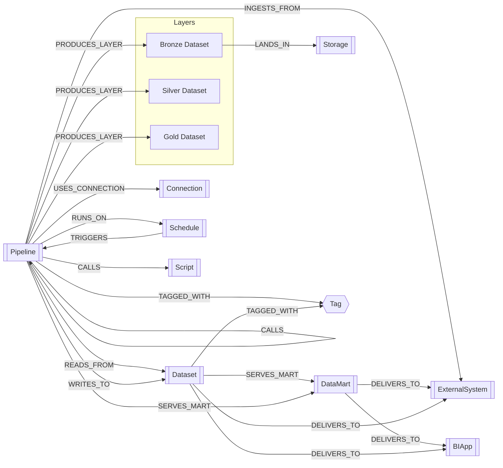

# Neo4j Data Model (Mermaid)

以下は SPEC.md のデータモデル（ノードラベルと主なリレーション）を mermaid で整理したものです。

```mermaid
graph LR
  %% ノード定義
  Pipeline[[Pipeline]]
  Dataset[[Dataset]]
  DataMart[[DataMart]]
  ExternalSystem[[ExternalSystem]]
  Storage[[Storage]]
  Connection[[Connection]]
  Schedule[[Schedule]]
  Script[[Script]]
  BIApp[[BIApp]]
  Tag{{Tag}}

  %% レイヤー別データセット例
  subgraph Layers
    Bronze[Bronze Dataset]
    Silver[Silver Dataset]
    Gold[Gold Dataset]
  end

  %% リレーション
  Pipeline -- RUNS_ON --> Schedule
  Schedule -- TRIGGERS --> Pipeline
  Pipeline -- USES_CONNECTION --> Connection
  Pipeline -- CALLS --> Pipeline
  Pipeline -- READS_FROM --> Dataset
  Pipeline -- WRITES_TO --> Dataset
  Pipeline -- PRODUCES_LAYER --> Bronze
  Pipeline -- PRODUCES_LAYER --> Silver
  Pipeline -- PRODUCES_LAYER --> Gold
  Pipeline -- INGESTS_FROM --> ExternalSystem
  Pipeline -- TAGGED_WITH --> Tag
  Dataset -- TAGGED_WITH --> Tag
  Bronze -- LANDS_IN --> Storage
  Dataset -- SERVES_MART --> DataMart
  Pipeline -- SERVES_MART --> DataMart
  DataMart -- DELIVERS_TO --> BIApp
  DataMart -- DELIVERS_TO --> ExternalSystem
  Dataset -- DELIVERS_TO --> BIApp
  Dataset -- DELIVERS_TO --> ExternalSystem

  %% スクリプトやジョブ補助情報
  Pipeline -- CALLS --> Script
```
