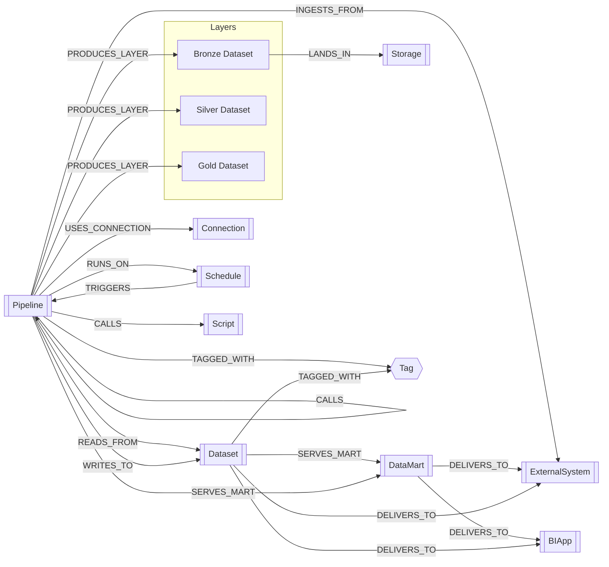

# Neo4j Data Model (Mermaid)

以下は SPEC.md のデータモデル（ノードラベルと主なリレーション）を mermaid で整理したものです。

## ノード詳細
| ラベル | 主要属性 (例) | 役割と使いどころ |
| --- | --- | --- |
| Pipeline | `id`, `name`, `type` (Ingestion/Mapping/Taskflow/Delivery), `domain`, `owner`, `sla`, `frequency`, `version`, `snapshot_at`, `tool` | IDMC のマッピング/タスクフロー/配信ジョブを表現。上流下流の依存や実行スケジュール、接続先を紐付ける中心ノード。 |
| Dataset | `id`, `name`, `system`, `schema`, `type` (Table/File/API/ObjectStorage), `layer` (Bronze/Silver/Gold), `sensitivity`, `quality_score`, `version`, `snapshot_at` | テーブル/ファイル/API エンドポイント等のデータ資産を表現。`layer` によりメダリオン層を識別し、品質や機密度のメタ情報も保持。 |
| DataMart | `id`, `name`, `domain`, `business_process`, `layer=Gold`, `refresh_policy`, `version`, `snapshot_at` | Gold 層の集計結果やマート。BI/外部配信の起点となり、関連パイプラインや入力データセットを集約。 |
| ExternalSystem | `id`, `name`, `type` (RDB/SaaS/API/File), `owner` | 外部ソース・外部連携先を表現。取り込み元にも配信先にもなり得る。 |
| Storage | `id`, `name`, `provider`, `path`, `format`, `retention_policy` | オブジェクトストレージやファイル領域。主に Bronze 着地場所を示し、保持ポリシーを記録。 |
| Connection | `id`, `name`, `system`, `connector`, `env` | パイプライン実行時に利用する接続定義（認証/ネットワーク設定など）。複数パイプラインで共有可能。 |
| Schedule | `id`, `name`, `cron`, `timezone`, `enabled` | 実行トリガー。パイプラインの運転計画や頻度を把握するために利用。 |
| Script | `id`, `name`, `language`, `path` | 補助スクリプトや外部ジョブを表現。再利用されるロジックを別ノードで管理。 |
| BIApp | `id`, `name`, `type` (Tableau/PowerBI/Looker/Custom) | BI/可視化ツール。DataMart や Dataset からの配信先として利用。 |
| Tag | `name`, `description` | 分類・責任者・SLA など任意メタ情報を付与するための汎用タグ。 |

## リレーション詳細
| リレーション (向き) | 主体 → 相手 | 意味と典型ユースケース |
| --- | --- | --- |
| RUNS_ON | Pipeline → Schedule | パイプラインが紐づくスケジュール。運転管理や停止影響の把握に使用。 |
| TRIGGERS | Schedule → Pipeline | スケジュールが起動するパイプライン。時系列ビューでの実行順把握に有用。 |
| USES_CONNECTION | Pipeline → Connection | パイプラインが利用する接続定義。ネットワークや資格情報の影響範囲を追跡。 |
| CALLS | Pipeline → Pipeline / Script | サブパイプラインやスクリプト呼び出し。複合タスクフローの分解や再利用箇所の把握に役立つ。 |
| READS_FROM | Pipeline → Dataset | 入力データセット。上流系の影響分析や lineage 探索の起点。 |
| WRITES_TO | Pipeline → Dataset | 出力データセット。下流データの生成元を特定する際に利用。 |
| PRODUCES_LAYER | Pipeline → Dataset (Bronze/Silver/Gold) | メダリオン層で生成されるデータセット。層ごとのバリューストリームを可視化。 |
| INGESTS_FROM | Pipeline → ExternalSystem | 取り込み元の外部システム。ソース切替時の影響確認に利用。 |
| TAGGED_WITH | 任意ノード → Tag | 分類・責務・SLA などのタグ付け。フィルタリングや検索に活用。 |
| LANDS_IN | Dataset (主に Bronze) → Storage | データが着地するストレージパス。ローディング先の健全性確認やコスト把握に役立つ。 |
| SERVES_MART | Dataset / Pipeline → DataMart | マートを構成・更新する対象。データマートの依存関係や再計算範囲を把握。 |
| DELIVERS_TO | DataMart / Dataset / Pipeline → BIApp または ExternalSystem | 配信経路や消費先。重複配信の整理や利用部門の可視化に活用。 |
